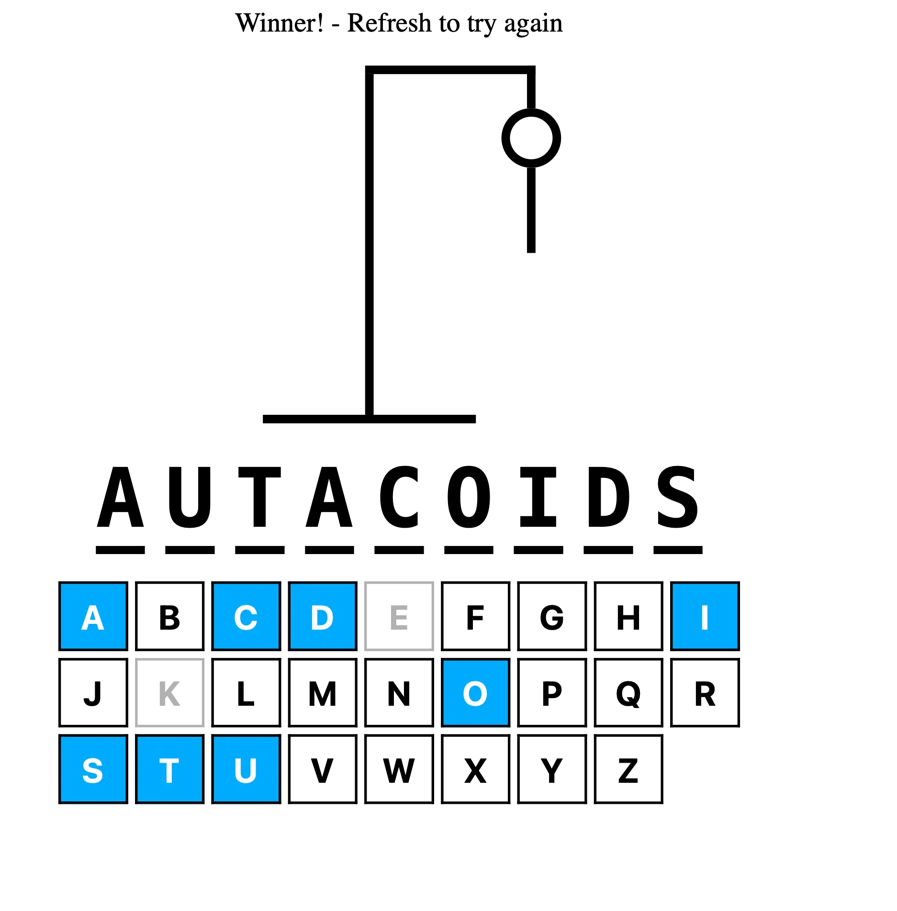

# Hangman Game (React + TypeScript)

Welcome to the Hangman Game! This is a simple web-based Hangman game built using React, TypeScript, and Vite. Test your vocabulary skills by guessing the word before the hangman is completed.

## How to Play

1. Clone the repository to your local machine.
2. Install the necessary dependencies by running `npm install` or `yarn install`.
3. Start the development server by running `npm run dev` or `yarn dev`.
4. The game will open in your default web browser.

## Rules

1. The game will choose a random word from an external API using the "random-word-api."
2. You need to guess the word by entering letters one by one.
3. You have a limited number of incorrect guesses (6 incorrect guesses in total) before the hangman is completed.
4. Once the hangman is completed or you have guessed all the letters in the word, the game ends.
5. If you correctly guess the word, you win! If the hangman is completed, you lose.

## How to Play

- When the game starts, you will see underscores representing each letter of the word to guess.
- Use your keyboard to guess a letter. If the letter is present in the word, it will be revealed; otherwise, an incorrect guess will be recorded.
- The game will disable input after you win or lose.
- Press the "Enter" key to start a new game. A new random word will be fetched from the API, and you can try your luck again.

## Contributing

Contributions are welcome! If you find any bugs or have suggestions for improvements, please open an issue or submit a pull request.

## Technologies Used

- React: A popular JavaScript library for building user interfaces.
- TypeScript: A typed superset of JavaScript, adding static types to the language.
- Vite: A build tool that provides fast and efficient development workflows.
- random-word-api: An external API used to fetch random words for the game.

## Credits

This project was inspired by Web Dev Simplified.

Hangman Favicon by IconMark from <a href="https://thenounproject.com/browse/icons/term/hangman/" target="_blank" title="Hangman Icons">Noun Project</a> (CC BY 3.0)

Enjoy the game! Happy guessing! 🎉
